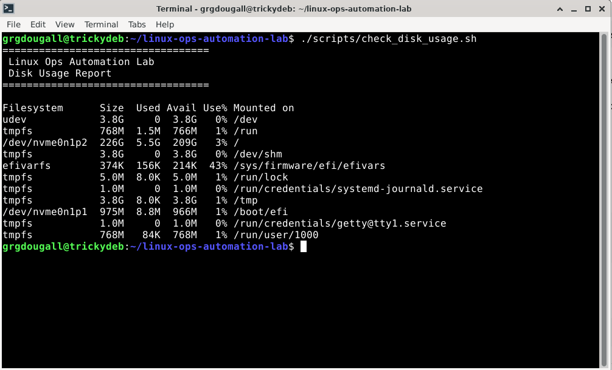
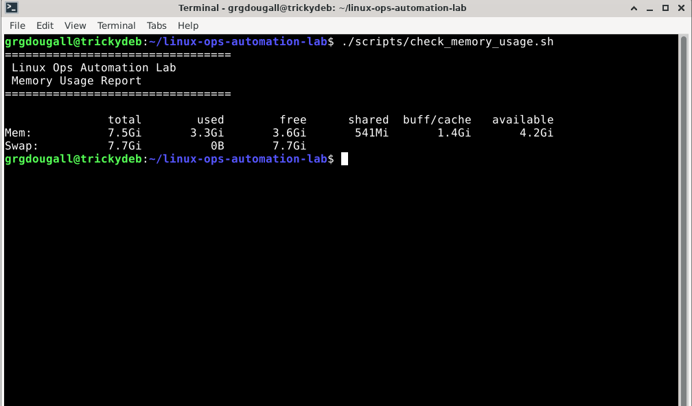
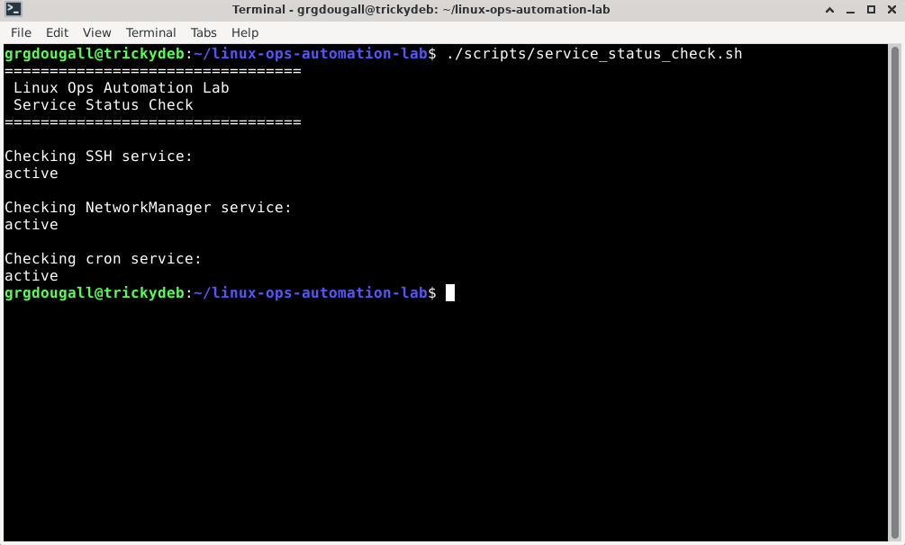
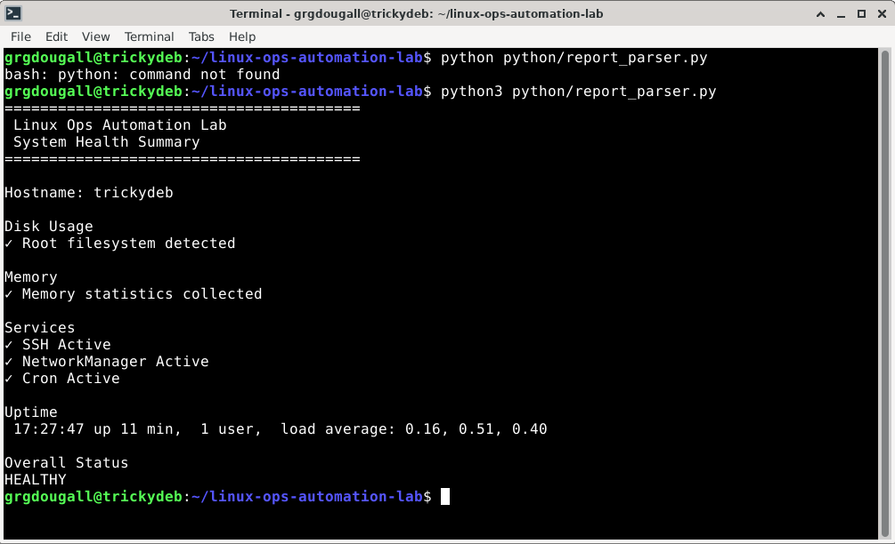
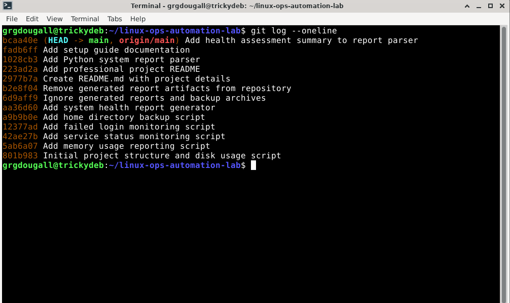
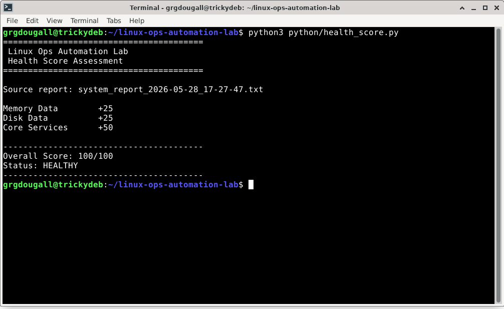
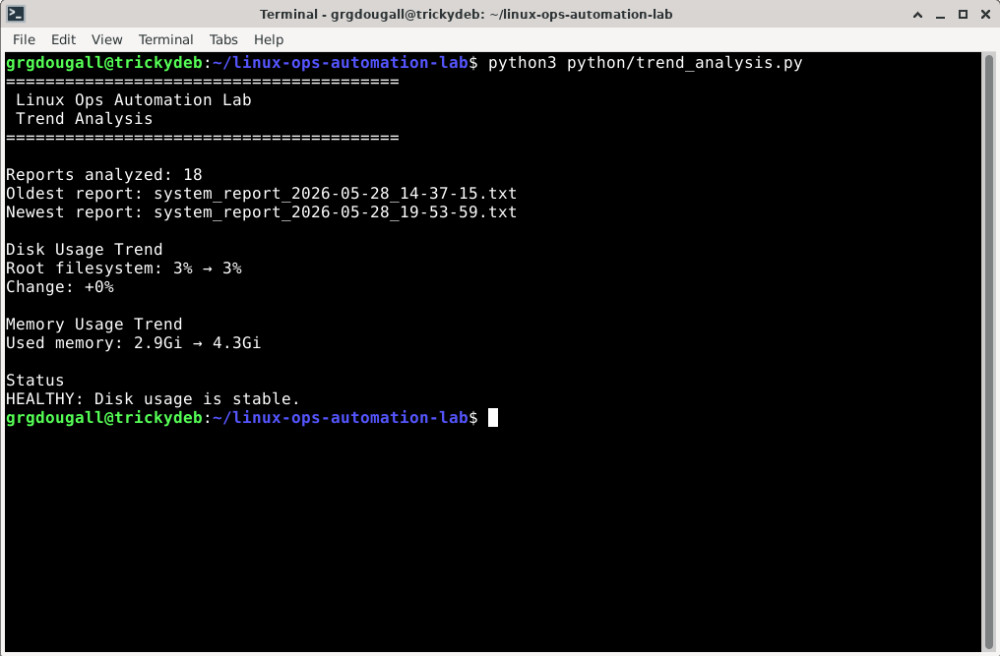
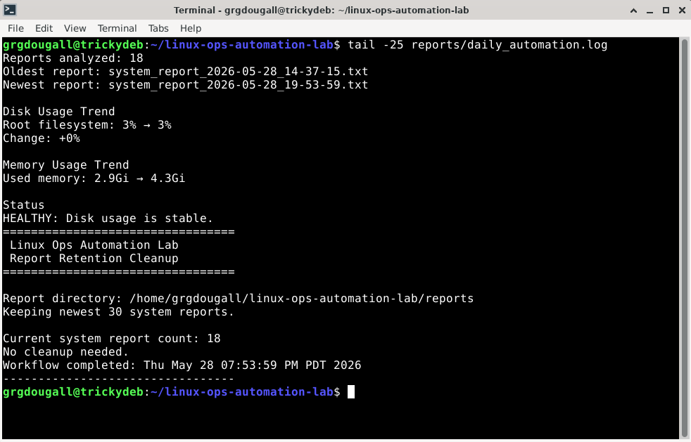

# Linux Ops Automation Lab

A lightweight Linux administration and automation toolkit built on Debian Linux. This project demonstrates practical system administration, Bash scripting, automation, monitoring, backup creation, report generation, and Git-based workflow management.

## Overview

The goal of this project is to simulate common Linux operations tasks that a junior system administrator, IT support specialist, or cybersecurity analyst might perform in a real environment.

The toolkit includes scripts for:

* Monitoring disk usage
* Monitoring memory usage
* Checking service health
* Reviewing authentication activity
* Creating compressed backups
* Generating system health reports

All scripts were developed and tested on Debian Linux.

## Technologies Used

* Debian Linux
* Bash
* Git
* GitHub
* Linux System Utilities

  * df
  * free
  * systemctl
  * tar
  * hostname
  * uptime

## Project Structure

```text
linux-ops-automation-lab/
├── scripts/
│   ├── check_disk_usage.sh
│   ├── check_memory_usage.sh
│   ├── service_status_check.sh
│   ├── check_failed_logins.sh
│   ├── backup_home_directory.sh
│   └── generate_system_report.sh
│
├── reports/
│
├── documentation/
│
├── screenshots/
│
├── python/
│
├── README.md
└── .gitignore
```

## Included Scripts

### check_disk_usage.sh

Displays current disk utilization using human-readable formatting.

### check_memory_usage.sh

Displays current memory and swap usage.

### service_status_check.sh

Checks the operational status of common Linux services:

* SSH
* NetworkManager
* Cron

### check_failed_logins.sh

Reviews authentication logs and reports failed login activity when available.

### backup_home_directory.sh

Creates a compressed backup archive of selected user data and stores it in the reports directory.

### generate_system_report.sh

Generates a consolidated system health report including:

* Hostname
* Disk usage
* Memory usage
* Uptime
* Service status

### cleanup_old_reports.sh

Applies a simple report retention policy by keeping the newest system reports and deleting older report files.

## Example Output

Example system report contents:

```text
Linux Ops Automation Lab
System Health Report

Hostname
Disk Usage
Memory Usage
Uptime
Active Services
```

## Screenshots

Screenshots will be added as the project evolves.

## Future Enhancements

### Python Reporting

* Parse generated reports
* Create summarized output
* Export formatted reports

### trend_analysis.py

Compares the oldest and newest generated system reports to identify basic trends in disk usage and memory usage.

### Automation

* Scheduled execution using cron
* Automated report retention
* Automated backup cleanup

### AI Integration

Future versions may integrate AI-assisted analysis to:

* Summarize system health
* Identify priority issues
* Recommend remediation actions
* Generate executive summaries

## Learning Objectives

This project demonstrates:

* Linux administration
* Bash scripting
* System monitoring
* Backup automation
* Report generation
* Git version control
* GitHub workflow management
* Technical documentation

## Screenshots

The following screenshots demonstrate the Linux automation scripts, generated reports, Python-based health analysis, and Git workflow used throughout the project.

### Disk Usage Report



### Memory Usage Report



### Service Status Report



### System Health Summary



### Git Commit History



### Health Score Assessment



### Health Score Assessment


### Trend Analysis



### Daily Automation Log


